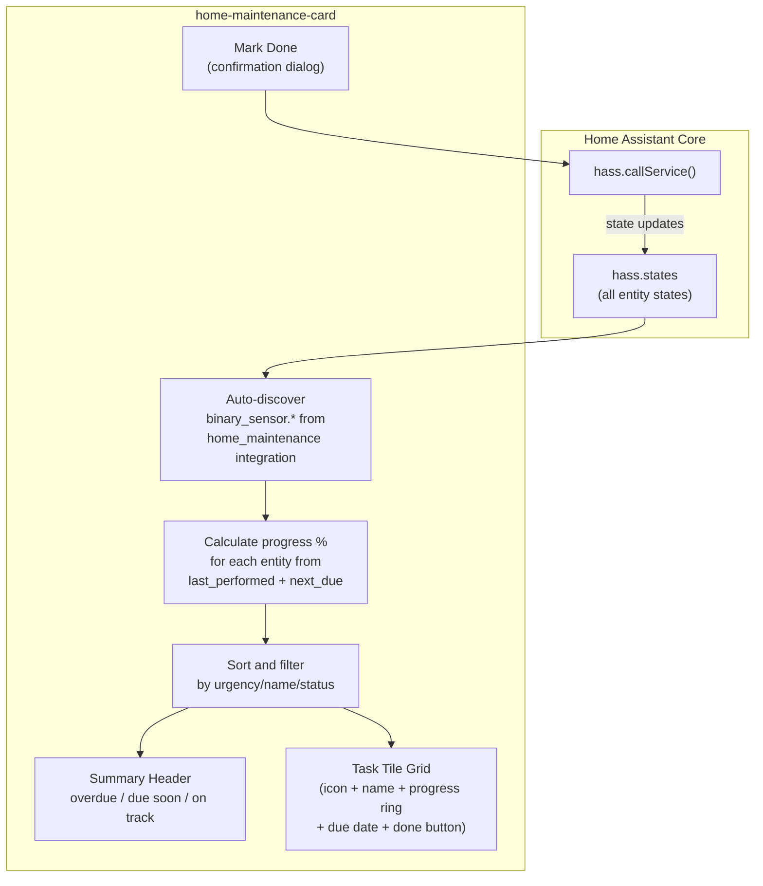

# Custom HACS Card: `home-maintenance-card`

## Why Option 2 is the right call

The Home Maintenance integration already exposes everything we need as data:

- **Entity type**: `binary_sensor` (on = due/overdue, off = on track)
- **Attributes**: `last_performed`, `next_due`, `interval_value`, `interval_type`
- **Icon**: per-task, defaults to `mdi:calendar-check`
- **Service**: `home_maintenance.reset_last_performed(entity_id, performed_date?)`

No need to reimplement the integration (Option 3). But a custom card (Option 2) gives us full control over the visual presentation that YAML-based dashboards (Option 1) can never match -- proper progress rings, animations, auto-discovery, and a visual editor.

---

## Feature Set

### Core

- **Auto-discovery**: Finds all `binary_sensor` entities from the `home_maintenance` integration automatically (no manual entity listing)
- **Manual override**: Optionally specify entities or exclude specific ones
- **Progress visualization**: Circular progress ring (default) or horizontal bar -- computed as `(now - last_performed) / (next_due - last_performed)`
- **Color-coded urgency**: Green (0-50%) -> Yellow (50-75%) -> Orange (75-99%) -> Red (100%+ overdue)
- **"Mark Done" button**: Calls `home_maintenance.reset_last_performed` with a confirmation dialog and a satisfying check animation
- **Summary header**: "2 overdue / 1 due soon / 5 on track" at the top

### Views

- **Grid** (default): Responsive CSS grid of task tiles
- **List**: Compact rows for dense information
- **Compact**: Minimal tiles, icon + name + mini progress only

### Sorting and Filtering

- Sort by: urgency (default), name, next due date
- Filter: all, overdue only, due soon, on track
- Configurable "due soon" threshold (default: 7 days)

### Polish

- Overdue tasks get a subtle pulsing glow
- Smooth CSS transitions on progress changes
- Skeleton loading state
- Responsive (mobile/tablet/desktop)
- Theme-aware (HA CSS custom properties for light/dark)
- Localization (English, Spanish, Catalan)

### Visual Config Editor

Full GUI editor with HA native components (`ha-select`, `ha-textfield`, `ha-switch`, etc.) for all config options.

---

## Data Flow



---

## Technology Stack

Based on the [boilerplate-card](https://github.com/custom-cards/boilerplate-card) community standard:

- **Lit 3** (web components)
- **TypeScript 5**
- **Rollup** (bundler, outputs single ES module)
- **custom-card-helpers** (HA integration utilities)
- **home-assistant-js-websocket** (entity types)

---

## Project Structure

```
home-maintenance-card/
├── .github/
│   └── workflows/
│       └── release.yml               # GitHub Actions: build + release on tag
├── src/
│   ├── home-maintenance-card.ts       # Main card: auto-discovery, layout, delegation
│   ├── editor.ts                      # Visual config editor (GUI)
│   ├── types.ts                       # Config interface + entity shape types
│   ├── const.ts                       # Version, card name, defaults, color thresholds
│   ├── styles.ts                      # Shared CSS (grid, list, responsive, animations)
│   ├── utils.ts                       # Progress calc, sorting, entity filtering, color
│   ├── localize/
│   │   ├── localize.ts                # i18n loader
│   │   └── languages/
│   │       ├── en.json
│   │       ├── es.json
│   │       └── ca.json
│   └── components/
│       ├── task-tile.ts               # Single task: icon, name, ring, button
│       ├── progress-ring.ts           # SVG circular progress with color gradient
│       └── summary-header.ts          # Overdue/due-soon/on-track counts
├── rollup.config.js
├── rollup.config.dev.js
├── tsconfig.json
├── package.json
├── hacs.json                          # HACS metadata (type: plugin)
├── README.md
└── LICENSE
```

---

## Key File Details

### `src/types.ts` -- Card configuration interface

```typescript
export interface HomeMaintenanceCardConfig extends LovelaceCardConfig {
  type: string;
  title?: string; // Card title (default: "Manteniments")
  entities?: string[]; // Manual entity list (optional, auto-discovers if omitted)
  exclude_entities?: string[]; // Entities to exclude from auto-discovery
  view_mode?: 'grid' | 'list' | 'compact'; // Layout mode
  progress_type?: 'ring' | 'bar'; // Progress visualization style
  sort_by?: 'urgency' | 'name' | 'due_date';
  filter?: 'all' | 'overdue' | 'due_soon' | 'on_track';
  due_soon_days?: number; // Threshold for "due soon" (default: 7)
  show_header?: boolean; // Show summary header
  show_filter_bar?: boolean; // Show sort/filter controls
  columns?: number; // Grid columns (auto if omitted)
  compact?: boolean; // Compact mode
}

export interface TaskData {
  entity_id: string;
  name: string;
  icon: string;
  state: string; // 'on' | 'off'
  last_performed: Date;
  next_due: Date;
  interval_value: number;
  interval_type: string;
  progress: number; // 0-100+ (can exceed 100 if overdue)
  days_remaining: number; // negative if overdue
  urgency: 'on_track' | 'due_soon' | 'overdue';
}
```

### `src/utils.ts` -- Core calculation logic

Key functions:

- `discoverEntities(hass)`: Filters `hass.states` for `binary_sensor.*` entities belonging to the `home_maintenance` integration (by checking for `last_performed` + `next_due` + `interval_value` attributes)
- `calculateProgress(last_performed, next_due)`: Returns 0-100+ percentage
- `getUrgencyColor(progress)`: Returns CSS color based on thresholds
- `getUrgencyLevel(progress, dueSoonDays)`: Returns `'on_track' | 'due_soon' | 'overdue'`
- `sortTasks(tasks, sortBy)`: Sorts task array
- `formatDaysRemaining(days, locale)`: "3 days left" / "2 days overdue"

### `src/components/progress-ring.ts` -- SVG circular progress

A Lit component rendering an SVG circle with:

- `stroke-dasharray` / `stroke-dashoffset` for progress arc
- Dynamic color based on percentage
- Percentage text in center
- Smooth CSS transition on value changes

### `src/components/task-tile.ts` -- Individual task card

Renders a single tile with:

- Icon (from entity)
- Task name
- Progress ring or bar
- "Due in X days" or "X days overdue" text
- "Done" button (calls service with confirmation)
- CSS class `.overdue` with pulsing animation when overdue

### `src/home-maintenance-card.ts` -- Main card

Orchestrates everything:

1. Auto-discovers entities (or uses manual list)
2. Calculates progress for each
3. Applies sorting and filtering
4. Renders summary header
5. Renders grid/list of `task-tile` components
6. Handles `shouldUpdate` efficiently (watches all relevant entity IDs)

### `src/editor.ts` -- Visual config editor

Accordion sections:

- **General**: Title, view mode, progress type
- **Entities**: Auto-discover toggle, manual entity picker, exclusions
- **Display**: Sort by, filter, columns, due soon threshold
- **Features**: Show header, show filter bar, compact mode

### `hacs.json`

```json
{
  "name": "Home Maintenance Card",
  "render_readme": true,
  "filename": "home-maintenance-card.js"
}
```

### `.github/workflows/release.yml`

Triggered on tag push (`v*`). Runs `npm ci && npm run build`, then creates a GitHub release with `dist/home-maintenance-card.js` attached.

---

## YAML Usage Examples

Minimal (auto-discovers everything):

```yaml
type: custom:home-maintenance-card
```

Full config:

```yaml
type: custom:home-maintenance-card
title: Manteniments
view_mode: grid
progress_type: ring
sort_by: urgency
filter: all
due_soon_days: 7
show_header: true
show_filter_bar: true
columns: 3
```

---

## Implementation Order

Structured to get a working card fast, then layer on features.
